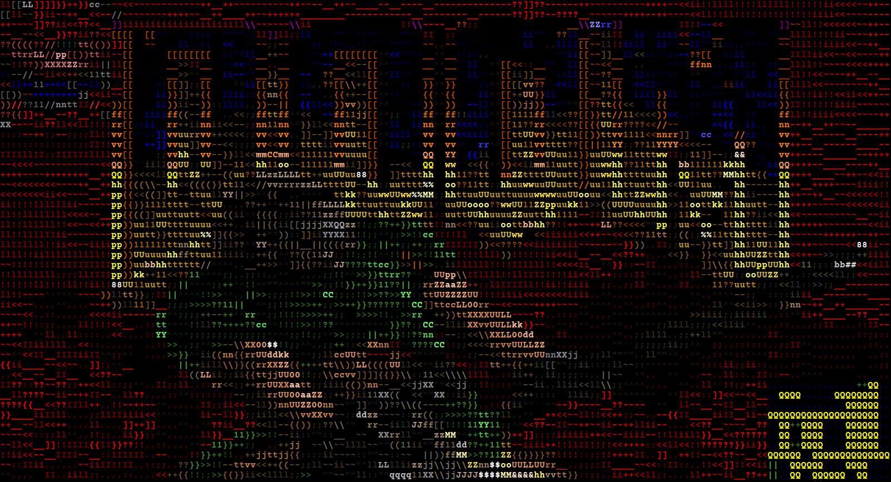

# DOOM-ASCII



**Text-based DOOM in your terminal!**

Source-port of [doomgeneric](https://github.com/ozkl/doomgeneric). Does not have sound.

You will need a WAD file (game data). If you don't own the game, the shareware version is freely available.

**Try it out over telnet!**
```sh
telnet doom.w-graj.net 666
```

## Usage
Binaries for Windows and Linux are provided as [github releases](https://github.com/wojciech-graj/doom-ascii/releases).

### Build from Source
#### Linux / MacOS
Requires Make and a C compiler. Creates `_<YOUR OS>/game/doom_ascii`
```sh
make
```

### Other
```sh
make PLATFORM=<|unix|musl|win32|win64> <|zip|appimage|appimage-zip|appimage-release|release|clean|clean-all>
```

## Settings
The following command-line arguments can be supplied:
- `-nocolor`: Disable color.
- `-nograd`: Disable text gradients, exclusively use fully filled-in pixels.
- `-nobold`: Disable bold text.
- `-chars <ascii|block|braille>`: Use ASCII characters, [unicode block elements](https://en.wikipedia.org/wiki/Block_Elements), or [braille patterns](https://en.wikipedia.org/wiki/Braille_Patterns).
- `-erase`: Erase previous frame instead of overwriting. May cause a strobe effect.
- `-fixgamma`: Scale gamma to offset darkening of pixels caused by using a text gradient. Use with caution, as colors become distorted.
- `-kpsmooth <>`: Set the number of ms a key has to be left depressed for it to count as such. Used to counteract jittery inputs when key repeat delay exceeds frametime.
- `-scaling <>`: Set resolution. Smaller numbers denote a larger display. A scale of 4 is used by default, and should work flawlessly on all terminals. Most terminals (excluding Windows CMD) should manage with scales up to and including 2.

## Controls
Default keybindings are listed below.

|Action         |Default Keybind|
|---------------|---------------|
|UP             |ARROW UP		|
|DOWN			|ARROW DOWN		|
|LEFT			|ARROW LEFT		|
|RIGHT			|ARROW RIGHT	|
|STRAFE LEFT	|,				|
|STRAFE RIGHT	|.				|
|FIRE			|SPACE			|
|USE			|E				|
|SPEED			|]				|
|WEAPON SELECT  |1-7            |

Keybinds can be remapped in `.default.cfg`, which should be placed in the same directory as the game executable.

## Performance tips
### Display
Most terminals aren't designed for massive throughput, so the game cannot be played at full 320x200 resolution at high frames per second.

Pass the command-line argument `-scaling` to determine the level of scaling (See [Settings](#settings)).

## Troubleshooting
### Colours are displayed incorrectly
If the displayed image looks something like [this](https://github.com/wojciech-graj/doom-ascii/issues/8), you are likely using a terminal that does not support 24 bit RGB. See [this](https://github.com/termstandard/colors) for more details, troubleshooting information, and a list of supported terminals.

### Running make throws an error
Run `make --version` and `cc --version` to verify that you have Make and a C compiler installed. If you do, and you're still getting an error, file a github issue.
