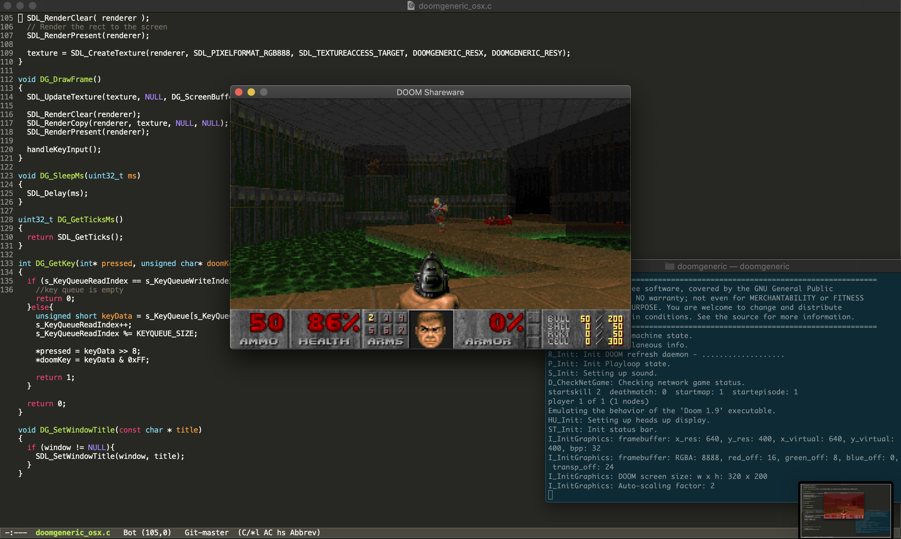
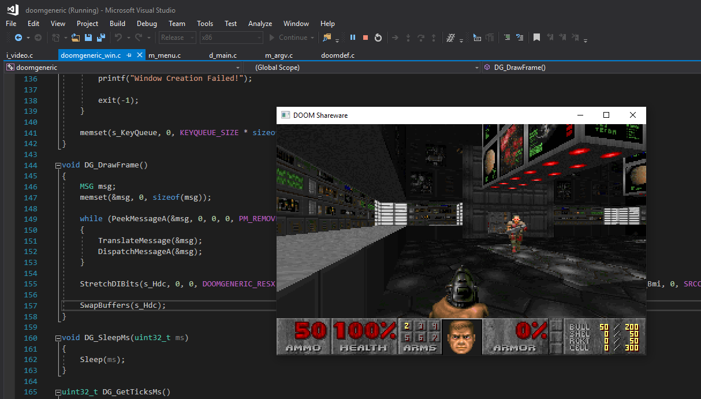
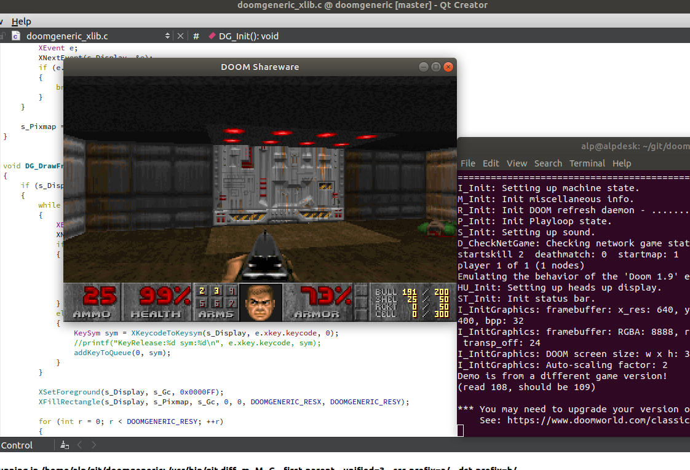
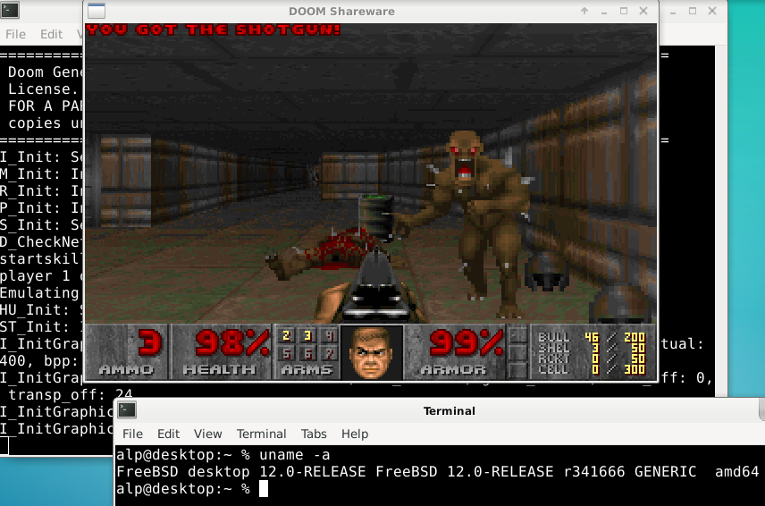

# doomgeneric
The purpose of doomgeneric is to make porting Doom easier.
Of course Doom is already portable but with doomgeneric it is possible with just a few functions.
The limitation is there is no sound!

To try it you will need a WAD file (game data). If you don't own the game, shareware version is freely available (doom1.wad).

# porting
Create a file named doomgeneric_yourplatform.c and just implement these functions to suit your platform.
* DG_Init
* DG_DrawFrame
* DG_SleepMs
* DG_GetTicksMs
* DG_GetKey

|Functions            |Description|
|---------------------|-----------|
|DG_Init              |Initialize your platfrom (create window, framebuffer, etc...).
|DG_DrawFrame         |Frame is ready in DG_ScreenBuffer. Copy it to your platform's screen.
|DG_SleepMs           |Sleep in milliseconds.
|DG_GetTicksMs        |The ticks passed since launch in milliseconds.
|DG_GetKey            |Provide keyboard events.
|DG_SetWindowTitle    |Not required. This is for setting the window title as Doom sets this from WAD file.

# platforms
I have ported to Windows, X11, and Soso. Just look at (doomgeneric_win.c or doomgeneric_xlib.c).

Note that X11 port is not efficient since it generates pixmap by XDrawPoint. It can be further improved by using X11 extensions.

## SDL

## Windows

## X11 - Ubuntu

## X11 - FreeBSD

